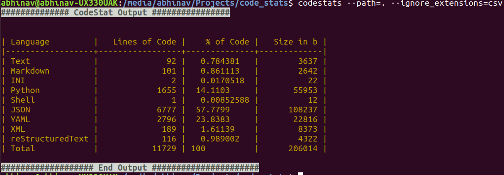

# codestat [](https://travis-ci.org/lyft/flyteadmin)

Code Stat is a command line tool to generate code statistics for a given directory.

## Statistics

These statistics include

  1. Total lines of code per file Type / Language.
  2. Percentage wise break-up of different file Type / Language.
  3. Space occupied by each file Type / Language.


## Getting Started

These instructions will get you a copy of the project up and running on your local machine for development and testing purposes.

### Prerequisites

codestats requires python 3 and the following packages to work.

  1. click
  2. pathlib
  3. tabulate
  4. pytest (only for testing purpose)

#### Installing Dependencies

`pip install -r requirements.txt` from the source code of the project.

### Installing codestats

#### Installing from Source
codestats can be installed from the source which is available on github. To do this follow the instructions below.

1. Copy the project from https://github.com/abhinavshaw1993/code-stats
2. Run the ```setup.py``` file with the command ```python setup.py install```
3. codestats is ready for use.

#### Installing from pip

```
pip install code-stats
```

### Using codestats

After installing -

1. You can find statistics of a folder by running
```
codestats --path=path/to/folder
```

2. You can exclude files by ignoring extensions using the **--ignore_extensions** argument which accepts comma separated extensions.
```
codestats --path=path/to/folder --ignore_extensions=csv,json,etc
```

3. You can see options available in codestats as codestats by
```
codestats --help
```

Sample example in Linux.




## Running the tests

These tests are useful if you want to extend codestats. For the time being I am not accepting any pull-requests but ideas and bugs as issues are welcome.

There are few tests in codestats.
1. Testing the statistics generation.
2. Testing the util functions.

To run these tests first you need **pytest**. Instructions on how to install pytest have been given above. Test codestats using

```
python setup.py test
```
or from the `code_stats directory`

```
pytest ./code_stats
```

## Authors

**Abhinav Shaw** - [Github](https://github.com/abhinavshaw1993)


## License

This project is licensed under the MIT License - see the [LICENSE.md](LICENSE.txt) file for details
